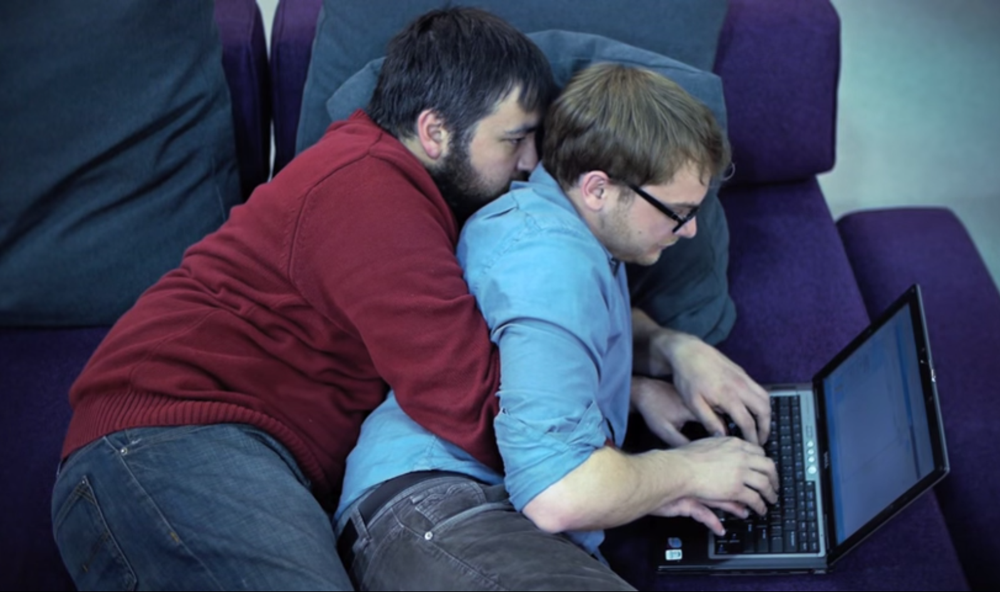

Section 0 - Pair Programming
===========================

[Go to course navigation](../navigation.md)

Throughout this course you will be working in pairs to try and build a prototype website. Working in pairs is not just something to help us learn on this course its also a fundamental skill used by many developers to improve their code quality, pace of learning and make a few friends along the way.

Pair programming is the process whereby two people actively collaborate on developing code. Used as part of a general teamwork approach it leads to improved code quality, team communication, knowledge share and huge learning gains. Not suprisingly, [Large scale studies of computer science students](http://www.cs.pomona.edu/classes/cs121/supp/williams_prpgm.pdf) have shown greatly improved outcomes when students pair program on coding problems.

How to
------

While there are many styles of pair programming we will be using a common driver :red_car: navigator :loudspeaker: style here.

The key component of pair programming is regular driver/navigator switching :twisted_rightwards_arrows:. When pair programming, at any one time, one person should be the driver, i.e. the person actually typing, while the other pair should be the navigator. The navigator's role is to try and think more broadly about where the code is going; to act as a sounding board to the driver and to offer suggestions on architectural design or to be looking up documentation related to the task at hand. The navigator should avoid constantly mentioning spelling mistakes and other typos unless the driver is really stuck.

It's absolutely critical that you swap driver and navigator roles frequently - probably at least once every 15 minutes. If one person carries on driving for the whole session both parties learning and code quality will be impaired. Whether you are extrovert or introvert, driver or navigator it is the responsibility of both of you to rotate roles. Don't be a keyboard hog!

Pair programming can be very exhausting as it will often lead to a state of very highly focused concentration. Make sure you take occasional breaks (at least every 90 minutes), and remember that learning how to effectively pair with individuals from all backgrounds and personality types is at least as important as any individual coding skills. 

To prod you into good practices where-ever you see a :twisted_rightwards_arrows: you should think about switching roles.

General Pair Programming Do's and Don'ts
--------------------------------------

**Do's:**
 - Before you begin, check in with each other about your energy levels, moods and working styles.
 - Talk
 - Listen
 - Rotate roles
 - Be patient
 - Respect each other
 - Take breaks
 - Prepare for the session
 - Take care of personal hygiene
 - Have fun

**Don'ts:**
 - Be bossy
 - Be intimidated
 - Be quiet
 - Suffer in silence

[Previous page](../README.md) | [Continue to Section 1](./section1.md)
