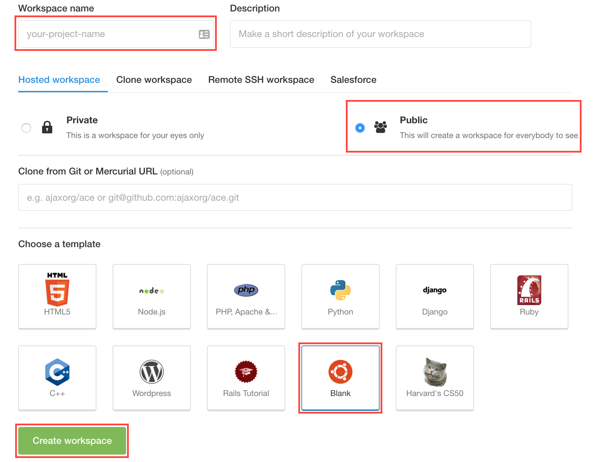
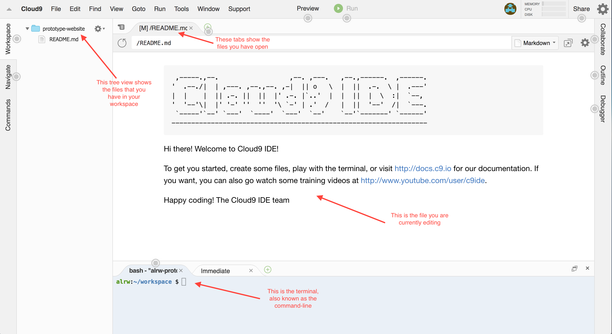

Development Environment
=======================

[:globe_with_meridians: Go to course navigation :globe_with_meridians:](./navigation.md)

Developers generally work closer to the bare bones of the computer than your average user. That means lots of time in the 'command line' and not relying on 'GUI' (Graphical User Interface) tools. However, to get your computer setup for web development is a art in and of itself- especially on Windows.

Fortunately, there are a number of cloud based development environments available that provide almost identical experience but with everything ready for you out of the box. For this course we will be using Cloud9.

Getting Started
---------------

Choose who is going to be the driver and the navigator to begin with and follow the steps below on the drivers laptop.

1. [Navigate to the Cloud9 account you created earlier :link:](https://c9.io/)
2. Choose `Create a new workspace`
3. Call your workspace `prototype-website`
4. Choose a Hosted workspace and make it Pubic
5. Choose `Blank` as a template
6. Create the workspace (This may take a minute or two)



When your workspace has been created you should see it open in your browser. It will look something like this:



What you are seeing in this image is an **Integrated Development Environment (IDE)**. IDEs are highly complex applications and take a bit of getting used to. Think Microsoft Word, on steroids, exposed to radiation in a secret nuclear incident and having gained super powers...something like that. Regardless, the important thing is that Cloud9 gives us the four critical components of our development environment:

 - A **file system** to store our source files (code, images, HTML, CSS and others)
 - An **editor** to edit the above mentioned source files
 - An **operating system** to run the program described by these files
 - Finally, a **command line** or **terminal** to send instructions to the operating system

 Updating the README
----------------------------

You'll notice that a single file has been created for you already - `README.md`. It's a convention of all good projects to have a README file that explains what the project is for and provides information about how to install and run the program.

If you double click the file in the tree view, it will open for editing in the main pane. The file has a `.md` extension, which means it is intended to be written in **Markdown** a popular syntax for lightly styling text files. Markdown is ubiquitous on **Github** [and here is a useful guide to it :link:](https://github.com/adam-p/markdown-here/wiki/Markdown-Cheatsheet). For now though, let's just create a basic placeholder for our information.

Delete the contents of the file and replace them with the following (those are equal signs under the title):

```
Prototype Website
=================

Built by [Your names here]
```

Make sure you save the file. Switch to the preview tab: has it been updated with your new content?

Introducing Ruby
---------------

Ruby is a [programming language :link:](http://www.webopedia.com/TERM/P/programming_language.html). That is to say that it is a formal computer language designed to communicate instructions to a machine, particularly a computer. It is also interpreted. As an aside: languages broadly fall into two catagories: interpreted and compiled. Interpreted languages are read by a program and converted into machine code when they are run whereas compiled langagues are converted into machine code by a compiler. This produces a file that can then be run. This may sound like an exercise in semantics but the point is that different languages have different properties that make them particularly suited to certain tasks.

Ruby as a language is perfect for our needs and importantly it comes pre-installed on your Cloud9 workspace. To test this, go to the command line and type (don't include the `$`)

```
$ ruby -v
```
(...then hit return to enter it.) and you should see something like this:

```
ruby 2.3.0p0 (2015-12-25 revision 53290) [x86_64-darwin15]
```

> We'll use the `$` sign to represent the command line prompt and to differentiate commands you should enter from output you should see.

This tells us the currently installed version of Ruby (which we requested by passing the `-v` to the `ruby` command).

Writing a Ruby Program
----------------------

Create a file in your workspace called `hello.rb`. By convention, Ruby files have the extension `.rb`. The benefit of this convention is that Cloud9 will provide Ruby **syntax highlighting** for all files with the `.rb` extension.

Open the file in the editor and add the following content:

```ruby
puts 'Hello Ruby'
```

See how syntax highlighting works? The IDE recognises the Ruby language and uses colours to differentiate elements of the 'grammar'. You may see different colours depending on your chosen theme.

Save the file. Now go to the command line and enter the following: 

```
$ ruby hello.rb
```
This tells the Ruby engine to run the code in the `hello.rb` file. You should see the following output:
```
Hello Ruby
```
You've just written a command-line program: you run it from the command line and it outputs to the command line! 

:twisted_rightwards_arrows: At this point let's do our first switchover (staying on the same laptop) and move onto the next section.

[:arrow_backward: Previous section](./section0.md) | [Continue to the next section :arrow_forward:](./section2.md)

