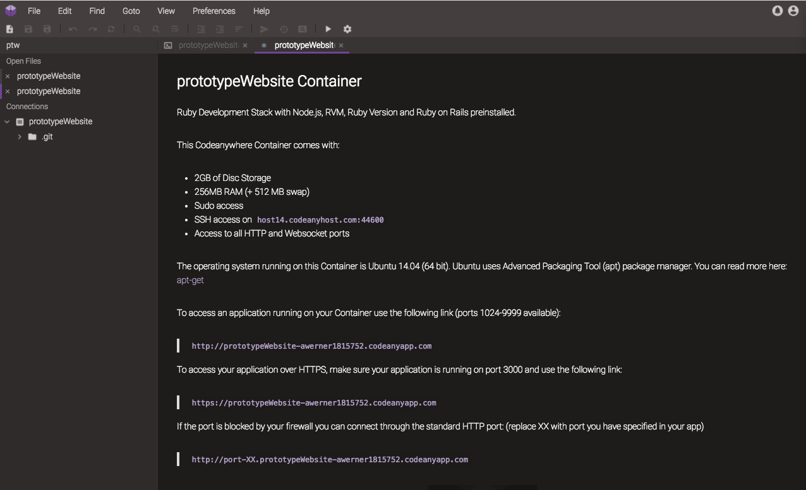

Development Environment
=======================

[:globe_with_meridians: Go to course navigation :globe_with_meridians:](../navigation.md)

Developers generally work closer to the bare bones of the computer than your average user. That means lots of time in the 'command line' and not relying on 'GUI' (Graphical User Interface) tools. However, to get your computer setup for web development is a art in and of itself- especially on Windows.

Fortunately, there are a number of cloud based development environments available that provide almost identical experience but with everything ready for you out of the box. For this course we will be using CodeAnywhere.

Getting Started
---------------

Choose who is going to be the driver and the navigator to begin with and follow the steps below on the driver's laptop.

1. [Navigate to the CodeAnywhere account you created earlier :link:](https://codeanywhere.com/editor/) - After some loading time you should see the following page:


2. We will be creating a workspace that is preconfigured to have almost everything we need to get going. With that in mind select `Container` from the menu on the left side of the connection wizard.

3. In the `Name` field enter your projects name. As we will be creating a prototype website you could perhaps go with the imaginative name: `prototypeWebsite`?!

4. Scroll through the environment options in the centre of the pane until you get to the `Ruby` options and then the `Ubuntu` environment as shown below:


5. Now click `Create`!

After a little bit of work, your environment should be created for you and you should arrive on a landing page with some helpful information about the container you have just created in the cloud (Don't worry too much for the moment what a container or the cloud actually are).



What you are seeing in this image is an **Integrated Development Environment (IDE)**. IDEs are highly complex applications and take a bit of getting used to. Think Microsoft Word, on steroids, exposed to radiation in a secret nuclear incident and having gained super powers...something like that. Regardless, the important thing is that CodeAnywhere gives us the four critical components of our development environment:

 - A **file system** to store our source files (code, images, HTML, CSS and others)
 - An **editor** to edit the above mentioned source files
 - An **operating system** to run the program described by these files
 - Finally, a **command line** or **terminal** to send instructions to the operating system

Creating a README
-----------------

It's a convention of all good projects to have a README file that explains what the project is for and provides information about how to install and run the program. Right click on the `prototypeWebsite` container icon under `Connections` in the tree view to the left of the screen. Select `Create File` and enter the name `README.md`.


Once created the file should open in editing pane and also show up in the tree view to the left of the screen. The file has a `.md` extension, which means it is intended to be written in **Markdown** a popular syntax for lightly styling text files. Markdown is ubiquitous on **Github** [and here is a useful guide to it :link:](https://github.com/adam-p/markdown-here/wiki/Markdown-Cheatsheet). For now though, let's just create a basic placeholder for our information.

Type the following into our newly created file (those are equal signs under the title):

```
Prototype Website
=================

Built by [Your names here]
```

Introducing Ruby
---------------

Ruby is a [programming language :link:](http://www.webopedia.com/TERM/P/programming_language.html). That is to say that it is a formal computer language designed to communicate instructions to a machine, particularly a computer. It is also interpreted. As an aside: languages broadly fall into two catagories: interpreted and compiled. Interpreted languages are read by a program and converted into machine code when they are run whereas compiled langagues are converted into machine code by a compiler. This produces a file that can then be run. This may sound like an exercise in semantics but the point is that different languages have different properties that make them particularly suited to certain tasks.

Ruby as a language is perfect for our needs and importantly it comes pre-installed on your CodeAnywhere workspace. To test this, go to the command line and type (don't include the `$`)

> The command line should be the first tab open in your editor pane.

```
$ ruby -v
```
(...then hit return to enter it) and you should see something like this:

```
ruby 2.1.2p95 (2014-05-08 revision 45877) [x86_64-linux]
```

> We'll use the `$` sign to represent the command line prompt and to differentiate commands you should enter from the output you should see.

This tells us the currently installed version of Ruby (which we requested by passing the `-v` to the `ruby` command).

Updating our Ruby Version
-------------------------

Before we go ahead, we need to ensure that the version of ruby we are running is updated so that some of the newer features we'll experiment with during the day will work.

For this we'll use another tool that comes preinstalled with CodeAnywhere called `rvm` short for Ruby Version Manager which is just a program for controlling the version of the Ruby language that you are running.

Go back to the command line and run the following commands one after another:

```
$ rvm install 2.4.2
```

This should produce an output that looks a little like this:


Once this has finished installing we can then tell our environment to use this installed version as follows:

```
$ rvm use --default 2.4.2
```

If you then run:

```
$ ruby -v
```

You should see that the output has changed to show that we are now using our newly installed version:

```
ruby 2.4.2p198 (2017-09-14 revision 59899) [x86_64-linux]
```

Writing a Ruby Program
----------------------

Create a file in your workspace called `hello.rb`. By convention, Ruby files have the extension `.rb`. The benefit of this convention is that CodeAnywhere will provide Ruby **syntax highlighting** for all files with the `.rb` extension.

Open the file in the editor and add the following content:

```ruby
puts 'Hello Ruby'
```

See how syntax highlighting works? The IDE recognises the Ruby language and uses colours to differentiate elements of the 'grammar'. You may see different colours depending on your chosen theme.

Save the file. Now go to the command line and enter the following:

```
$ ruby hello.rb
```

This tells the Ruby engine to run the code in the `hello.rb` file. You should see the following output:

```
Hello Ruby
```

You've just written a command-line program: you run it from the command line and it outputs to the command line!

---------

:twisted_rightwards_arrows: At this point let's do our first switchover (staying on the same laptop) and move onto the next section.

--------
[:arrow_backward: Previous section](./section0.md) | [Continue to the next section :arrow_forward:](./section2.md)

