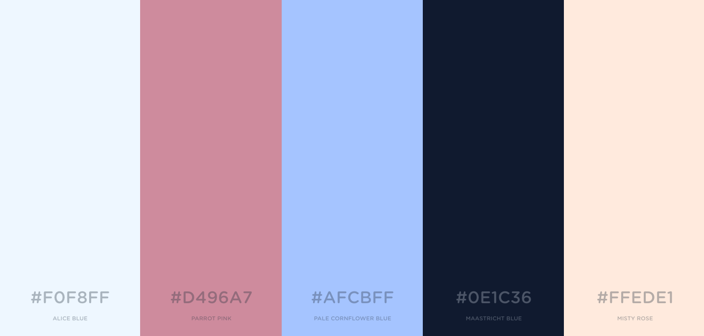
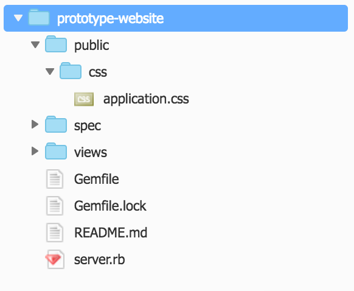

Adding Your Own Style
======================

[:globe_with_meridians: Go to course navigation :globe_with_meridians:](./navigation.md)

Previously we added some content using the Bootstrap framework and some of you were hopefully wondering what was being provided behind the scenes and how our website was already looking a little...styled? To put everything into perspective: so far we've written a little Ruby (telling our computer what to do and what to check for), a little HTML (decribing the structure of the content we want for our page) and now we come to CSS.

CSS (more formally Cascading Style Sheets) is the technology we use to define the *layout* and *design* of the HTML *structure* we have already written. Without CSS our webpages would just be a load of left-justified, black-text-on-white-background monstrosities.

Bootstrap will take us a long way, particularly when it comes to our page layout and scaling across different devices, but it still leaves a little to be desired in the looks department. So let's get under the hood and add our own styling to take our site to the next level.

Making our homepage pretty
--------------------------

Following a quick show-and-tell with our product owner they remarked that while they were impressed with your rapid prototyping ability they thought that the page looked a little bland. Thankfully they had just a the thing: a handy colour palette for us to brighten up the site and a user story to describe the work to be completed.

```
As a prototypical business owner
I want my site to be decked out in prototypical colours
So that my eyes are soothed every time I open my web-browser
```



Inline styling
--------------

Before we get down into the weeds we'll start with some of the basics.

To style our page we can add some CSS directly to our `index.erb` file by adding the `style` attribute to the HTML tag that you want to apply it to.

So for example, try the following in `index.erb` 

```html
<body style="background-color: red !important">
  ...
</body>
```

How red does your page look now?! 

The CSS we just added tells the browser to render the body of our page - i.e everything that's visible on the screen - with the specified background colour. Once upon a time, all CSS was added directly inline with the HTML like this. However, as with our ruby code this is going to be difficult to read and maintain. We want to put all of our styles in a separate file (or files) and keep our code DRY. As an aside the DRY principle (Don't repeat yourself) is key to being a developer. Essentially Duplication is waste and is likely to lead to code and processes that are harder to understand and much more error prone. Duplication of logic (which we are dealing with here) should be eliminated by abstraction while duplication of processes should be eliminated by automation (Hopefully this chimes with a few of the ideas we talked about with testing).

> Have a think about the many tasks that you do repetitively day in day out - could any of these be automated? If so how? If you can answer those questions maybe there's a startup in the making!

If you would like to know more about DRY and other key principles that guide software development then have a read of this article on the aptly named [Giant Robots Smashing into Other Giant Robots Blog](https://robots.thoughtbot.com/back-to-basics-solid).

Creating our own CSS
--------------------

Remove the inline style that we added in the last step so that you are left with `<body> ... </body>`. Now create a `public` folder in your Cloud9 workspace and then add a `css` folder inside `public`. Finally create a file called `application.css` inside the `css` folder. At the end your file tree should look a little like this:



Let's firstly normalise the background colour to be in line with the colour palette we've been given. Add the following:

```css
body {
    background-color: #FAF9F9;
}
```

You can interpret this CSS code as being the following instruction to the browser: *render* any `<body>` *element* on the page using the background colour with the Hex value `#FAF9F9`. In the case of `body` there should only ever be one on the page. But if you were refering to paragraph elements: `<p>` there could be many spread across the page.

Refresh your preview. Did it work (admittedly comparing two shades of white can be hard)? Did you expect it to work? It doesn't matter whether you were right or wrong - what matters is how you use that outcome to progress. Take a few moments to consider the changes we just made and how they might have affected the outcome.

The answer is that the browser doesn't know anything about `public/css/application.css`. Why would it? It's our responsiblity to tell the browser about this external stylesheet. Fortuantely, that's another fundamental part of the way the web works. In fact you've already done it once before!

In the same way we had to tell our html in `index.erb` to use the bootstrap CSS framework we now need to tell it to also pull in our newly created `application.css`.

Update your `<head>...</head>` section to include the following:

```html
<link rel="stylesheet" href="/css/application.css" type="text/css">
```

Notice how our `href` is in this case pointing to our local file rather than a remote url and that we don't need to add the `public`. Make sure your `index.erb` file is saved and then switch over to your blank `application.css`.

Now refresh your browser. The background should be *Snow* coloured.

That's probably not the most exciting change you've ever seen (if you can even see the change) so let's start fleshing things out with a bit of styling to our `jumbotron` element. Add the following to `application.css`.

```css
.jumbotron {
  margin-top: 5em;
  background-color: #FAF9F9;
  border: solid 2px #BEE3BD;
  color: #555B6E;
}
```

> Why do you think we've described the jumbotron using `.jumbotron` in our css file? If you're struggling then maybe [this will help](https://www.w3schools.com/cssref/sel_class.asp).

Now if you refresh your browser you should see a nicely outlined jumbotron more centrally positioned on our homepage with text in *Black Coral*. Exciting stuff!!!

Task 5
------

:twisted_rightwards_arrows:

 - [ ] Our work on the current user story is not complete. Our navbar is still looking distinctly "off brand". Style the navbar to bring it inline with the rest of our site and the colour palette. Feel free to go rogue and change the colors and values we've used in our CSS so far. The goal is consitency, but do add a bit of your own flare if you'd like.

 - [ ] *Bonus Task* - Add a custom font and update the `application.css` to style our `<h2></h2>` element to use it. [Google fonts is a great source](https://fonts.google.com/)

[Return to previous section](../courseSections/section9.md) | [Continue to the Answers](../tasks/task5.md)
