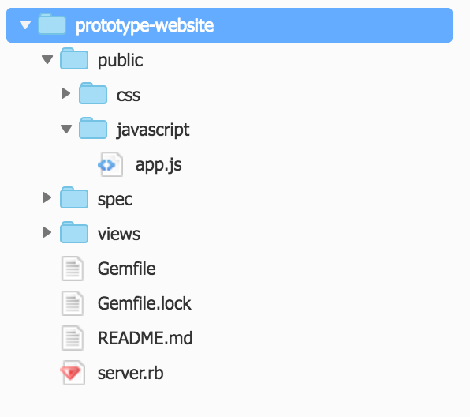
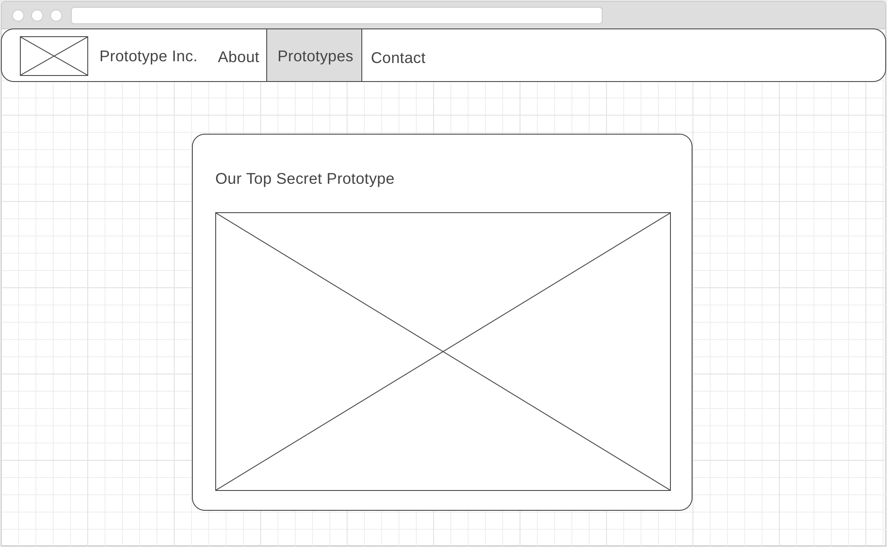
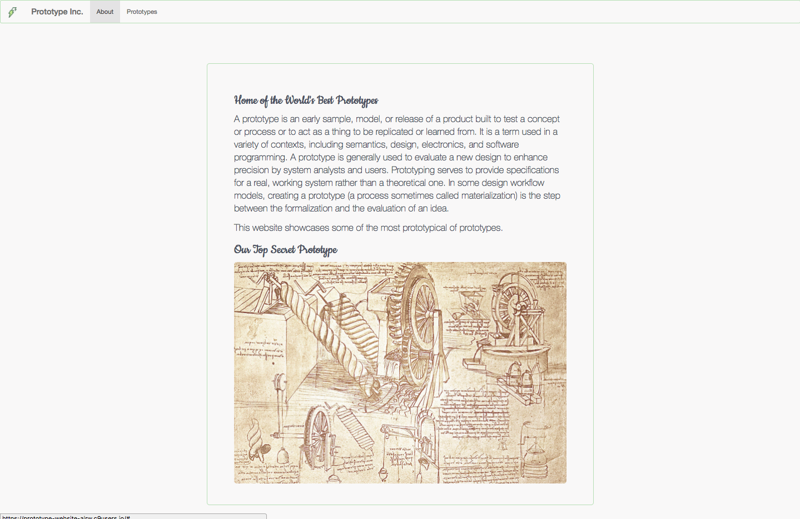
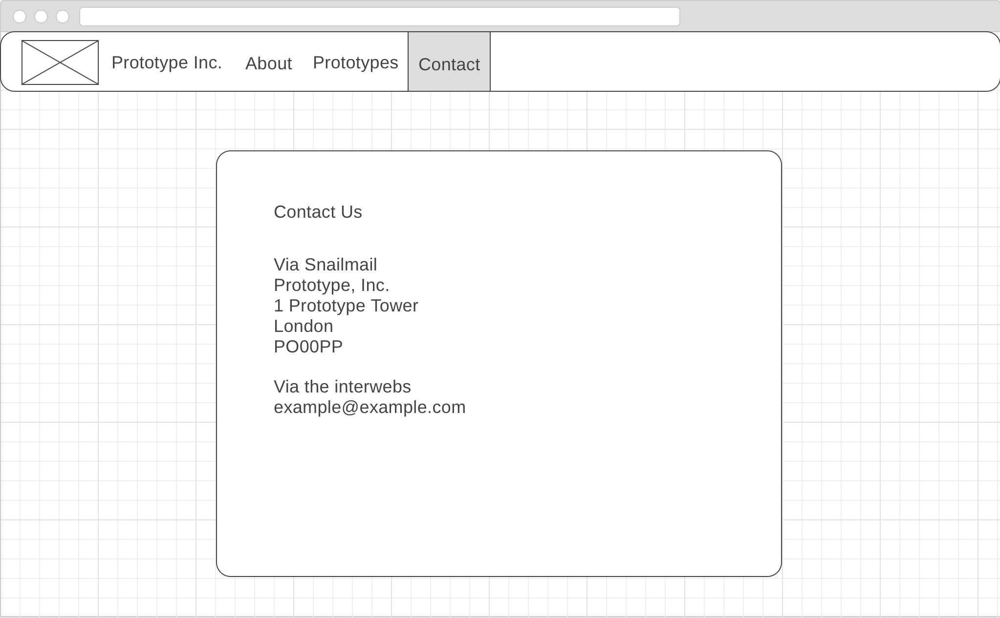

Section 11 - Making Things Happen With JavaScript
=================================================

[Go to course navigation](../navigation.md)

While our website is now an explosion of colour there's nothing dynamic about it. We're going to change that now using JavaScript. JavaScript is not just another programming language. Unlike Ruby which runs on the server JavaScript *runs in the browser*. that might not mean much right now, but it's a game changer! It means that we can load code into our pages from various sources - not just our own server - and have it run independently on the client's machine.

If you think that sounds potentially dangerous, you are right. A large number of Internet security vulnerabilites involve JavaScript. However, without JavaScript, the web would be a much duller place.

As with our Ruby and CSS code we'll be using a framework to help us along the way. In this instance the popular [JQuery](https://jquery.com/) Library.

As with our other frameworks we need to tell our application to load JQuery so that it's ready for our use.

Add the following line just before your closing `</body>` element in your `index.erb`.

```html
<script src="https://code.jquery.com/jquery-3.2.1.min.js" integrity="sha256-hwg4gsxgFZhOsEEamdOYGBf13FyQuiTwlAQgxVSNgt4=" crossorigin="anonymous"></script>
```

Loading JQuery into the page won't by itself do anything. For that we need to write our own Javascript to interact with it and the page. Let's begin by creating a folder `public/javascript` and within that create a file called `app.js`.

Once complete you should be left with the following file structure:



Now as with our JQuery library we need to add our `app.js` to the page with the following line again just before your closing `</body>` element.

```html
<script src="/javascript/app.js"></script>
```

Fantastic and it's just in time because it looks like our client has come back with some further requirements.

Adding Functionality to our page
--------------------------------

Having seen the initial site the client has been highly impressed and wants to engage us to extend it further: adding navigation tabs and additional content described in the following user stories:

```
As a prototypical user
I want to see plans for a top secret prototype
So that I can prototype it
```

```
As a prototypical user
I want to be able to navigate to different pages using tabs in the navigation bar
So that I may better consume information on prototypes
```

```
As a prototypical user
I only want to see the content relevant to the tab that I have selected
So that my mind is not overwhelmed with vast quantities of knowledge
```

Handily the client has also provided us with a wireframe for our new content.




Creating the content
--------------------

This breaks down our work nicely. However as you may have realised before we can start using javascript to control our view of the page there is some content that we need to deliver.

By now the HTML we need to add should be pretty familiar. For the first user story add the following within the `<div class="jumbotron" id="content">...</div>` below the `<div class="about"`.

```html
<div class="prototype hidden">
  <h2>Our Top Secret Prototype</h2>
  </img>
</div>
```

And add the following within the `<div class="container-fluid">...</div>` after the `<h4>...</h4>` element:

```html
<div class="collapse navbar-collapse">
  <ul class="nav navbar-nav">
    <li id="about" class="active"><a href="#">About</a></li>
    <li id="prototype"><a href="#">Prototypes</a></li>
  </ul>
</div>
```

Now with all of that content added if you refresh the page you should see a very cluttered website that looks a little like the following:



Now we can bring it all togather using a little CSS and Javascript. First we need to define a small piece of CSS that can be used to hide our elements. Add the following to your `application.css`.

```css
.hidden {
    display: none;
}
```

If you save the CSS file and reload the page you should now see that our homepage looks much like before. However, we currently have no way of making the hidden content show itself. Time to get the Javascript written.

Showing and Hiding
------------------

When trying to work out how to write our code it is often good to first try and ignore the code completely and find a way to articulate each step the you want the program to take.

This is such a good technique that it even has a name: [Rubber Duck Debugging](https://rubberduckdebugging.com/).

So let's try it out here. What are the steps that we need to go through to get to a working solution.

1. When we click on the *Prototypes* tab we want it to become active.
2. When we click on the *Prototypes* tab we want to see the *prototypes* section content.
3. When we click on the *Prototypes* tab we want the *About* tab to loose its active status.
4. When we click on the *Prototypes* tab we want the *about* section to be hidden.

Brilliant now that we have our sequence of events to code let's write that out in Javascript. In your `app.js` add the following:

```javascript
/* global $ */

$(document).ready(function(){

  $('#prototype').click(function(event){
    event.preventDefault();
    $('#prototype').addClass('active');
    $('.prototype').removeClass('hidden');
    $('#about').removeClass('active');
    $('.about').addClass('hidden');
  });

});
```

Save the file, reload the page and try to click the prototypes tab. Does it work? 

Now try clicking on the About tab to go back...not so good. We need to add another method to go back to our first tab. Luckily it should just be a reverse of what we've already written. Add this function below the first inside the `$(document).ready(function(){...});`

```javascript
$('#about').click(function(event){
  event.preventDefault();
  $('#about').addClass('active');
  $('.about').removeClass('hidden');
  $('#prototype').removeClass('active');
  $('.prototype').addClass('hidden');
});
```

Now if you save and reload your page you should be easily able to flick back and forth between the two tabs. Very nifty!

Task 6 
------

Our client has a further requirement for us:

```
As a prototypical user
I would like to be able to contact the owners of a prototypical site
In order to ask them questions about their prototypes
```

And accompanying wireframe.



 - [ ] Create the new contact details tab and add another javascript method that toggles whether it is shown.
 - [ ] Update the existing methods so that when you click on each tab only its content is shown.

[Return to previous section](./section10.md) | [Continue to the answers](../tasks/task6.md)
