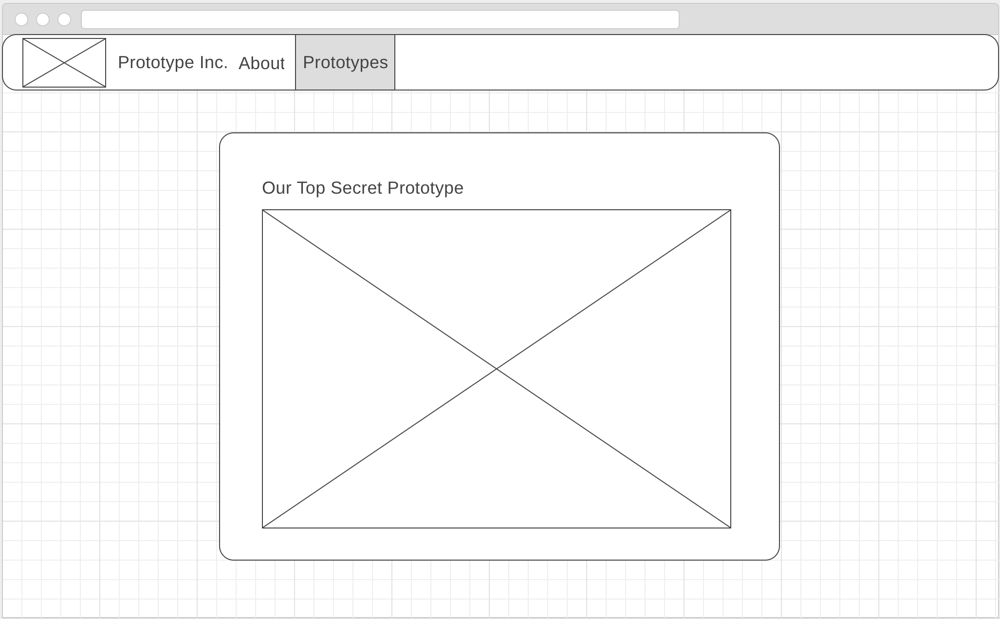

Section 10 - Making things happen with Javascipt
===============================================

While our website is now an explosion of colour it doesn't yet. We're going to change that now using JavaScript. JavaScript is not just another programming language. Unlike Ruby which runs on the server JavaScript *runs in the browser*. that might not mean much right now, but it's a game changer! It means that we can load code into our pages from various sources - not just our own server - and have it run independently on the client's machine.

If you think that sounds potentially dnagerous, you are right. A large number of Internet security vulnerabilites involve JavaScript. However, without JavaScript, the web would be a much duller place.

As with our Ruby and CSS code we'll be using a framework to help us along the way. In this instance the popular [JQuery](https://jquery.com/) Library.

As with our other frameworks we need to tell our application to load JQuery so that it's ready for our use.

Add the following line just before your closing `</body>` element in your `index.erb`.

```html
<script src="https://code.jquery.com/jquery-3.2.1.min.js" integrity="sha256-hwg4gsxgFZhOsEEamdOYGBf13FyQuiTwlAQgxVSNgt4=" crossorigin="anonymous"></script>
```

Loading JQuery into the page wont by itself do anything. For that we need to write our own Javascript to interact with it and the page. Lets begin by creating a folder `public/javascripts` and within that create a file called `app.js`.

Once complete you should be left with the following file structure:


Now as with our JQuery library we need to add our `app.js` to the page with the following line again just before your closing `</body>` element.

```html
<script src="/javascripts/app.js></script>
```

Fantastic we can now start adding Javascript code to our page, which is just as well because it looks like our client has come back with some further requirements.

Adding Functionality to our page
--------------------------------

Having seen the initial site the client has been highly impressed and wants to engage us to extend it further: adding navigation tabs and additional content described in the following user stories:

```
As a prototypical user
I would like to see plans for a top secret prototype
So that I can prototype it
```

```
As a prototypical user
I would like to be able to contact the owners of a prototypical site
In order to ask them questions about their prototypes
```

```
As a prototypical user
I would like to be able to navigate to different pages using tabs in the navigation bar
So that I may better consume information on prototypes
```

```
As a prototypical user
I only wish to see the content relevant to the tab that I have selected
So that my mind is not overwhelmed with vast quantities of knowledge
```

Handily the client has also provided us with some wireframes of what they believe the site should look like:




Creating the content
--------------------

This breaks down our work nicely. However as you may have realised before we can start using javascript to control our view of the page there is some content that we need to deliver for the first 3 user stories.

By now the HTML we need to add should be pretty familiar. For the first user story add the following within the `<div class="jumbotron" id="content">...</div>` below the `<div class="about"`.

```html
<div class="prototype hidden">
  <h2>Our Top Secret Prototype</h2>
  </img>
</div>
```

And for the second user story add the following below that:

```html
<div class="contact hidden">
  <h2>Contact Us</h2>

  <strong>Via snailmail</strong>
  <address>
    Prototype, Inc.<br>
    1 Prototype Tower <br>
    London <br>
    PO00PP
  </address>

  <strong>Via the interwebs</strong><br>
  <a href="mailto:#>example@example.com</a>

</div>
```

And lastly for the third user story add the following within the `<div class="container-fluid">...</div>` after the `<h4>...</h4>` element:

```html
<div class="collapse navbar-collapse">
  <ul class="nav navbar-nav">
    <li id="about" class="active"><a href="#">About</a></li>
    <li id="prototype"><a href="#">Prototype</a></li>
    <li id="contact"><a href="#">Contact</a></li>
  </ul>
</div>
```

Now with all of that content added if you refresh the page you should see a very cluttered website that looks a little like the following:


