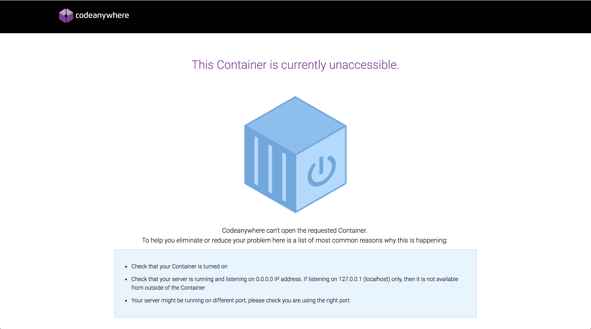

Deployment
==========

[:globe_with_meridians: Go to course navigation :globe_with_meridians:](./navigation.md)

One of the great benefits that we've already seen with Cloud9 is that the website we've created is already online. The URL we visit is available to the whole world and anyone can visit our great prototype site. However, this is really only intended for development and testing. If you don't interact with your workspace in Cloud9 for 2 days it will be shut down along with any running processes (i.e. your server). Your won't lose any work - you just won't be able to access the application from outside of Cloud9 until you log in and restart your server. Anyone trying to access your application will see something like this:



As you can imagine any client would be understandably a little annoyed if their brand new website ceased to work after only two days. What we need to do now is **deploy** the application to a **production environment**. Once upon a time that was no triivial matter. It might have required server teams, network teams, thousands of poundsworth of hardware and required weeks of planning. However, with the advent of cloud computing and Platform as a Service (PaaS), you can now set up a production environment in about 5 minutes and deploy to it in about 30 seconds.

Deploying to Heroku
-------------------

We're going to deploy our application the [Heroku :link:](https://www.heroku.com/). Heroku is a massive PaaS provider that offers free hosting for small projects. You should already have an account setup as part of the pre-course but if not head [there now :link:](https://www.heroku.com/) and set one up. Make sure to note the email and password you used, you'll need them in a second.

Heroku provides a suite of tools for interacting with it from the command line, called the [Heroku Toolbelt :link:](https://devcenter.heroku.com/articles/heroku-cli). Enter the following to check it's installed:

```
heroku --version
```

You should see something like:

```
lbelt/3.43.13 (x86_64-linux) ruby/2.3.0
heroku-cli/5.4.8-eee5ec9 (linux-amd64) go1.7.1
You have no installed plugins.
```

You can interact pretty easily with Heroku from their website but it's more fun to do it from the command line. First things first we need to hook up to our account:

```
$ heroku login
```

This will prompt you for the email and password you used to create your Heroku account. Once you are logged in you can create a new application:

```
$ heroku create
```

If you check back on the Heroku website you should see that your application has been created.


You can even visit your new application in a browser by following its unique url:


Before we push our application to Heroku we need to tell Heroku how to run our application:

Create a file in the top level of your workspace called `config.ru` with the following content:

```ruby
require './server'

run Sinatra::Application
```

If you've been adding, committing and pushing throughout the course today your application should be ready to go after the `config.ru` is added to git. All you need to do to get your application to the cloud is run the following:

```
$ git push heroku master
```

When the task finishes go back and visit the application url. What do you see?

:twisted_rightwards_arrows:

[:arrow_backward: Return to previous section](../courseSections/section12.md) | [Continue to the next section :arrow_forward:](../courseSections/section14.md)

