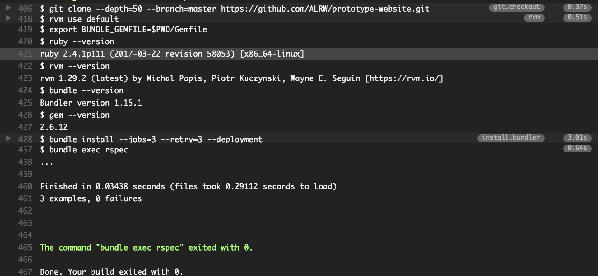

Continuous Integration and Continuous Delivery
==============================================

[Go to course navigation](../navigation.md)

The two phrases above, often shortened to CI and CD are currently big buzzwords that are often thrown around but rarely understood or used correctly. Throw in other things, such as, build pipelines, Integration Acceptance and Feature tests and things can start to get a bit bewildering but at their heart both are simply good Agile practices that help us to deliver quality features directly to the end-user as fast as possible. So let's try and demystify all of this by creating our own Continuous Delivery pipeline for our Prototype website.

Before we go ahead implementing this let's talk first about Continuous Integration. The good news is that you've been practicing most of the key ideas already. Simply put, it is the practice of *integrating* your code into a shared repository as often as practicable.

Each check in to this repository is then verified automatically by an automated build. there are a whole load of benefits to working in this manner but as a developer the key positives are that each check in is small, quick and easy: if anything does break it is easy to catch and fix which ultimately means less time fixing bugs and more time adding features. Speaking of which our fantastic Business Analyst has already put together a user story in conjunction with our client.

```
As a prototypical business owner
I want an automated build pipeline
So that I detect integration issues as early as possible
```

Setting up an automated build pipeline
-------------------------------------

In the precourse we setup access to a service called [Travis CI](https://travis-ci.org/) which we'll use to automate our CI pipeline.

But first, what is Travis and what exactly will it do for us? 

Simply put, Travis is just another computer somewhere out on the internet that we can interact with in a particular way. When setup correctly it will attempt to take our code from github, follow the instructions we've specified to install all the related programs that we need for our prototype to work (all of our gems for example), and then run the tests we've written to check that our application is in a good state to run and deploy anywhere. The output of this process is what is commonly known as a **build**.

With a good set of tests, we can have multiple developers, potentially all over the globe all adding code to the same project, safe in the knowledge that if an individual's changes break something then it will be caught before that broken feature can be seen by the end user.

So without further ado let's setup travis to run our tests every time we push some new code:

Use the following link to navigate to the [Travis homepage](https://travis-ci.org) and login using your github account.

> Note - this should be the Travis account of the person who has the `prototype-website` repository.

Now click on your github account portrait in the top right hand corner of the page:


You should now see a page that lists all the repositories held under your Github account.

Find your prototype website repository and check the switch to confirm that you want it to integrate with Travis.


Telling travis what to do
-------------------------

So far we've told Travis that we want it to integrate with our project but for this to be useful we actually need to find some way of telling it what we actually want it to do.

Thankfully Travis has a handy way of letting us do this. Create a new file called `.travis.yml` in the `prototype-website` directory and then add the following to it.

```yml
script: bundle exec rspec
```

It's as simple as that.

:twisted_rightwards_arrows: This time ensure that when you commit and push, you have a browser window open on your Travis home-page. What do you see?

Hopefully, if everything was connected correctly you ended up with an output that looked similar to the following:



Here you can see that after starting up, Travis clones your code, checks the version status of a number of different pieces of software such as the ruby language, runs `bundle install` to pull in all our dependencies and then runs the commands that we specified in our `.travis.yml` i.e. running all our tests. If all of that runs and passes then we have a successful build!

[Return to previous section](../courseSections/section13.md) | [Continue to the next section](../courseSections/section15.md)
