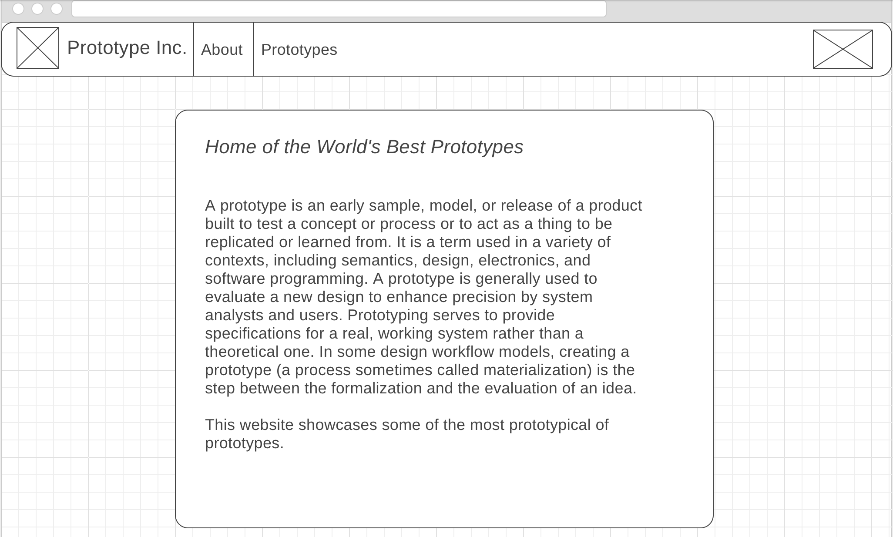
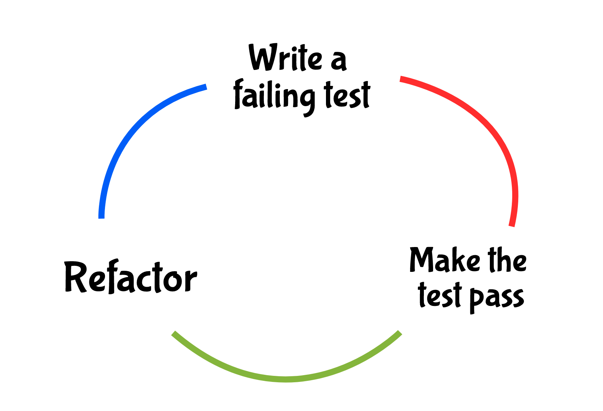

Changing Requirements, Rotting Code and Test Driven Development!
==================================================================

[:globe_with_meridians: Go to course navigation :globe_with_meridians:](../navigation.md)

For this final section we're going air a few aspects of developer dirty laundry and look at how we can possibly try and mitigate them.

As if by magic our client has also just come to us with some requirements that nicely illustrate these points. Their UX (User Experience) team have been doing some research with the public on our live prototype website and have come up with some interesting findings.

As the following highly technical graph shows it seems that there is some variation in the way that people contact Prototype Inc.


Our mysterious client would like to optimise their contact pathway reducing the number of forms of communication and also making it easier for the user to make contact. All of which is encapsulated in the following user story.

```
As a prototype obsessed user
I want a navber link to contact Prototype Inc by email 
So that I can contact my favourite prototype team in the most efficient manner
```

As the wireframe below shows, they would like us to remove the contact tab and add in a `mailto` link wrapped up as an image to the navbar.



Why am I deleting everything?
-----------------------------

This is a great example of a common occurance during any development project. Requirements that effect, modify or straight up remove a previous feature. This process multiplied many times leads to what is sometimes known as **[code rot](http://www.agile-process.org/change.html)**. Essentially each new change may lead to new subtle bugs that take time to fix and can themselves lead to even more subtle bugs. Eventually, in a worst case scenario, the cost of maintaining the code-base exceeds the resources available and it is actually more efficient to start from scratch.

This also leads us onto the topic of **[technical debt](https://martinfowler.com/bliki/TechnicalDebt.html)**. In our case, for this new requirement we could just delete the `Contact` tab from our navbar. This would nuke that feature in the fastest time possible allowing us to get on with adding in the new `mailto` icon. However, we would be left with a whole load of redundant code that could potentially cause bugs in the future. If we needed to get this new feature out to our customers ASAP this might be acceptable but over time constantly incurring similar debts would keep on reducing our speed of delivery to the point were we are adding very little value for our effort. Keeping technical debt under control is crucial in the long run.

As a rule, taking on technical debt should be a conscious choice as well as being the exception rather than the norm. One way to help ensure this is a robust set of tests with code that is written to be easily testable. This leads us nicely to another Agile development practice.

Test Driven Development
----------------------

Earlier in this course we delved into testing. However, the tests we wrote were authored after the fact. On a site as small as this that is a forgivable sin but think about the *coverage* of the tests we do have, do you have confidence that we could run our tests and know that everything we had previously implemented was working as required?

[Test Driven Development :link:](http://www.extremeprogramming.org/rules/testfirst.html) (TDD) is a methodology for forceing ourselves to write well tested and easily testable code. At a high level it follows the iterative process shown below often shortened to the phrase: *red, green, refactor*.



This creates a nice rhythm: you write a failing test to define an aspect of your problem (this should be small and well defined); you then write the **simplest** code that will make this test pass (go green); at this point, you can look to see if this code can be refactored or optimised in anyway; now you can start the process all over again by writing your next failing test.

This has all the benefits of testing that we have talked about previously with a couple of further added benefits. Firstly, as a process it forces you to think through the problem you are trying to solve rather than just jumping in head first. Essentially, you have to document in code (your tests) exactly what problem you are trying to solve. As a nice byproduct, anyone else working with your code can use your tests to understand exactly what you are doing. Secondly, the code you create should be short and simple: it will implement only the features you wanted and through your tests these will also be future proofed, reducing the potential for future bugs.

Final task
----------

Now that we have covered all of the above it just remains for you to try and implement this new requirement using a TDD approach. Remember to make sure you clean up anything that could be regarded as technical debt.

If you want to go all out on the tests consider looking at the [rspec documentation :link:](http://rspec.info/documentation/3.6/rspec-core/) although you should already have covered everything needed to test this feature.

If you go down the route of testing what HTML you are returning on the page then you may want to search [Stack Overflow :link:](https://stackoverflow.com) for how to escape quotes in ruby.

For the image `mailto` link feel free to use anything you want but as a simple starting point consider looking at the [Bootstrap glyphicons :link:](https://getbootstrap.com/docs/3.3/components/).

Good luck!

----------------------------------
[:arrow_backward: Return to previous section](../courseSections/section14.md) | [Continue to the answers :arrow_forward:](../tasks/task7.md)
