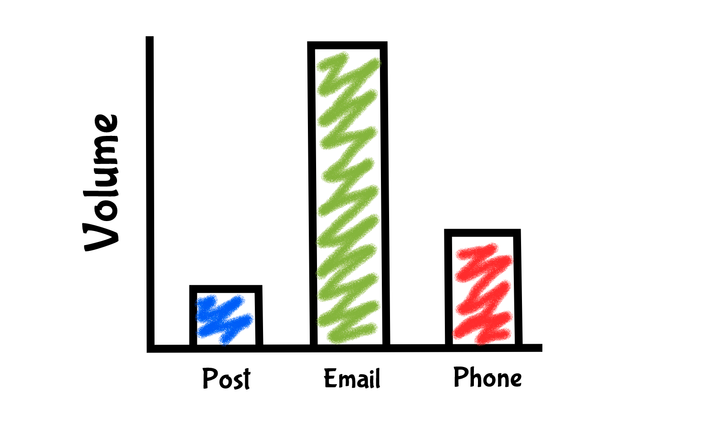

Changing Requirements, Rotting Code and Test Driven Development!
==================================================================

For this final section we're going air a few aspects of developer dirty laundry and look at how we can possibly try and mitigate them.

As if by magic our client has also just come to us with some requirements that nicely illustrate these points. Their UX (User Experience) team have been doing some research with the public on our live prototype website and have come up with some interesting findings.

As the following highly technical graph shows it seems that there is some variation in the way that people contact Prototype Inc.

----------------------------------
[Return to previous section](../courseSections/section14.md) | [Continue to the answers](../tasks/task7.md)
