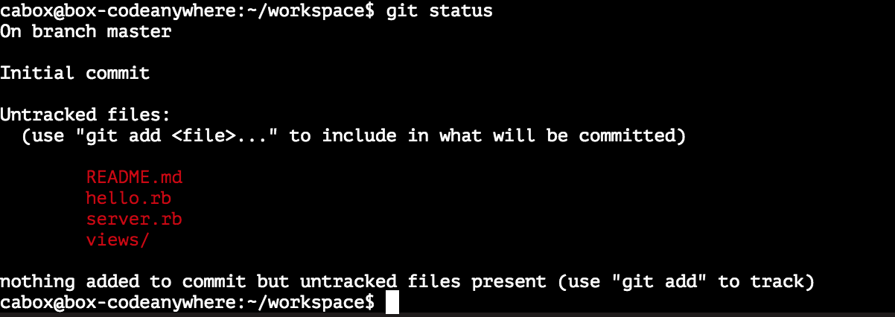
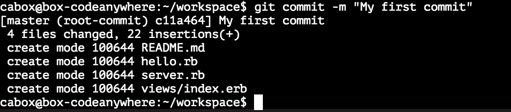

Git and Version Control
=======================

[:globe_with_meridians: Go to course navigation :globe_with_meridians:](../navigation.md)

So we have the beginnings of our website but before we jump into creating an all singing, all dancing web application there is one other aspect of our workflow that needs to be covered: **version control**.

Version control is the process and technology used to **control** various **versions** of the code that you write. If, for example, you were building a house, you'd likely start with the foundation and make sure it's solid before you started building the walls. You'd want to stop after the walls were built to make sure everything lines up properly before adding the roof. You wouldn't want to build the entire thing and realise, after the roof is built, that there's a crack in the foundation. 

Software version control helps us avoid these problems by allowing us to keep various versions of what we're building. If we realise we've made a mistake, we can revert back to a previous version that we know is solid.

Additionally, version control allows multiple versions to be built simultaneously and then brought together. It doesn't matter whether you're working in a team or writing code alone, version control is something you absolutely need to understand as a developer (as you'll see it's also very useful for pair programming).

Using Git to version control your own code
-----------------------------------------

The most common version control system used by web developers is git. With git you get all of the benefits of controlling various versions of your code and the ability to handle distributed work among teams. While there are a number of other examples of version control software out there, git is the largest and most popular and it's what we're going to use on this course.

Luckily for us Cloud9 comes with git installed but, just to check, type the following into the command line:

```
$ git --version
```

which should give you

```
git version 2.10.2
```

Setting up your first git repository
-----------------------------------

Now that we know we have the tools, let's use git to start version controlling the code we're writing.

The first thing we need to do is tell git to make our current directory a *git repository*. Type the following into the command line:

```
$ git init
```
You should see the following:
```
Initialized empty Git repository in /home/ubuntu/workspace/.git/
```
We now have an initialised repository - something that only has to be done once for every repository. This repository is really just a folder that has all its files *under version control*. When you run `git init`, git created a hidden directory called `.git` (with a dot in front) that it uses to track all changes to the files in the directory. Now that we're setup we can actually start tracking the work we've done so far.

Adding Committing and Status
---------------------------

Often when working with a version control system (and throughout today) you'll want to see what state your repository is in. For this we have the `status` command try this in the command line:

```
$ git status
```

What did you see?

Hopefully if you've kept up with things so far you should see something like this on your screen:



While there is potentially a lot of information here, the important thing that git is telling us is that we have a number of untracked files.

Git as a tool is meant to act like a time machine, allowing you to go back to where you've been in the past. However, allowing you to travel to an arbitrary moment in time wouldn't make sense. The thing about time travel is you may want to go back to yesterday, or yesterday morning, or that specific moment right before you try to rob the bank. However, you wouldn't want to go to any specific second of any of the past years, unless that second was somehow important for some reason.

Tracking every single change you make while coding would be unnecessary and slow (imagine how much disk space it would take to record every single keystroke of every developer on a large project!). So instead of tracking every change, we must tell git when to create a *checkpoint* also known as a *commit* in git terminology that we'll be able to go back in time to.

However, before creating this *commit*, we need to specify what is being committed. What if we have a temporary file that we don't want to be saved anywhere long-term? Imagine you're using git to track changes to a novel you're writing. You've finished chapter one and you want to commit it to git, so that you could always go back in time to the moment the first chapter is finished. However, you also have some random notes for chapter two that you don't want to save just yet (you'll commit them when chapter two starts taking some shape).

So, you'd tell git to only add chapter one to the staging area. The staging area is a special place that git uses to keep track of all files that will be committed on the next step. So even if you have several files that have changes since the last commit (or since the repo was created), you can choose which of them will get committed. So, we're telling git that we're happy with the file as it is now and we'd like to create a *checkpoint* (or *commit*) that we could go to in case we ever want to.

So let's go ahead and do that - adding everything that we've done so far:

```
$ git add README.md server.rb views/index.erb 
```

Even though there is no output from git after you tell it to add a file, unless you see an error message you can assume it went well.

> Try running `git status` now. What changes do you see?

Now we can actually commit our staged changes. Run the following:

```
$ git commit -m "My First Commit"
```

This creates our snapshot in time and unlike when we added our files, git now gives some output to tell us what it is doing.



This is what a successful commit message looks like. Git is telling you that it created a commit called "My First Commit" with a number (or hash or SHA) 094d3a5 (yours will be different). 3 files were changed and 33 insertions made (the lines of ruby, HTML and text that we have already written). Now if we ever need to go back to the very beginning we'll be able to `git checkout 094d3a5` to get us back to this point in time.

[:arrow_backward: Previous section](./section3.md) | [Continue to the next section :arrow_forward:](./section5.md)

