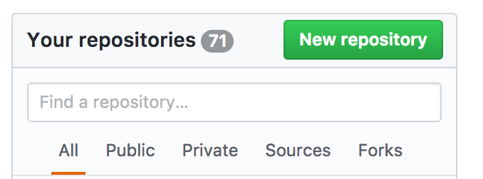
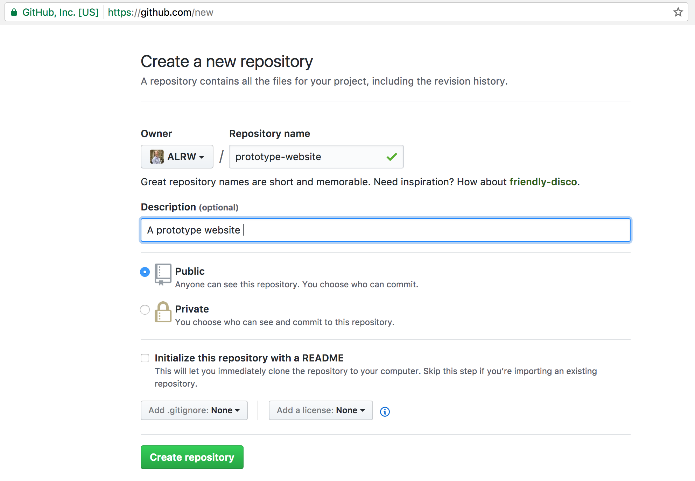
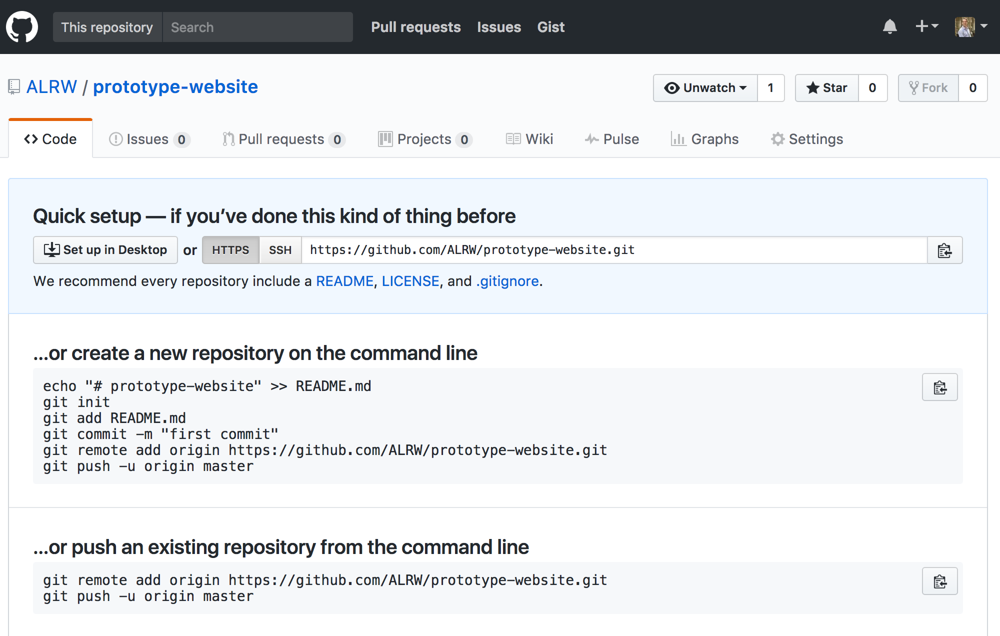
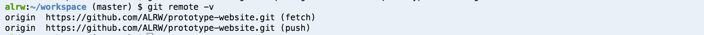

Github
=======

[:globe_with_meridians: Go to course navigation :globe_with_meridians:](../navigation.md)


Making all of these changes on your local computer is great, but we'll need some additional functionality provided by [Github :link:](https://github.com/) to collaborate with other developers.

Github does three things. Firstly it displays git repos in a visual way, so you can look at them online. Secondly, it serves as a common place for open source projects, so if you're using some open source library, the chances are you can find it on Github. Finally, Github provides a set of tools (forking, issues, etc) to help developers collaborate on projects. If you'd like to see an example Github project, checkout [Bootstrap :link:](https://github.com/twbs/bootstrap). We'll be incorporating this into our project later.

Github is Distributed 
--------------------
Github is really just another computer somewhere in the USA that you can create a repository on. When (as we will do in a minute) you go to Github and create a new repository, Github does `git init` on its local computer.

So Github's web interface is nothing more than a visual interface to git installed on Github's server.

The key feature of git when used in conjunction with Github is the ability to copy code between repositories. If you have a local repository (on your own laptop) and remote repository (on Github), you can copy code in either direction. Crucially you can also move code using git between developers' laptops, even directly if you wish.

Using Github
------------

If you haven't already then signup for a [free Github account :link:](https://github.com/join)

Once you are signed up and signed in click on the green new repository button:



Enter `prototype-website` into the *Repository name* field, add an optional description and make it public so that others can see it. Don't initialise it with a README. Then when you're happy create the repository:



You should see the following:



This means that you have a remote repository but it's empty. Github also shows us the steps required for a new repository and for an existing one. Since we already have a repository setup for our application in CodeAnywhere we only have two steps to do.

The first one is to connect our two repositories together. Right now you have two git repositories: one on CodeAnywhere and one on github but they don't know of each other. So, we need to connect them first.

Connecting two repositories is done by creating something called a *remote*. This is simply a record in a local repository that it's linked to another one. Let's take a look at the current list of the remotes for your local git repo. Run the following in the command line:

```
$ git remote -v
```

> What did you get? What do you think this means?

Hopefully, you were thinking that the lack of output means that your local git repo has no associated remotes. Now let's follow the advice that git gave us and set one up (The remote we're adding is the SSH URL and can be copied directly from git or entered manually as follows):

```
$ git remote add origin git@github.com:[Your username]/prototype-website.git
```

Now if you try `$ git remote -v` again you should see something similar to this:



What is origin? Honestly, you can replace origin with anything that you want it's just a conventional name but if you're using one repository to store code remotely (i.e. on github) and you're coordinating the work of a team then it's convention among developers to call that repository origin.

Awesome! Now your local repository knows that it's *linked* to another repository somewhere on github.com. Note that no real connection is established yet. You could have added a remote while being offline. To actually move the code we have committed locally to the repo on Github (called origin) we need to use the `git push` command. 

Pushing your code
---------------

Back in CodeAnywhere go to the command line and run the following:

```
$ git push -u origin master
```

You should see some output:

```
Warning: Permanently added 'github.com,192.30.253.112' (RSA) to the list of known hosts.
Counting objects: 6, done.
Delta compression using up to 8 threads.
Compressing objects: 100% (4/4), done.
Writing objects: 100% (6/6), 862 bytes | 0 bytes/s, done.
Total 6 (delta 0), reused 0 (delta 0)
To github.com:ALRW/prototype-website.git
 * [new branch]      master -> master
 ```

 This means that the push went well. Let's just quickly break down the command. It tells git to push code from your local repository (it's implied) to a repository called origin (that's the name of the remote we've just added). The last bit, "master", means that we're pushing the branch called "master" (the only branch we have right now). We haven't discussed branches yet, so don't worry about it. The "-u" switch means that these parameters should be saved as default, so next time you won't have to type "origin master". You'll be able to simply do:

 ```
 $ git push
 ```

 Try it now. Git will tell you that everything is up to date. This means that there are no local changes that haven't been pushed yet to Github.

 Ok, now let's flick over to Github itself. Refresh the page....What do you see?

 Hopefully, you should see all your code held on github with your readme displayed. Compare it to your local version, each of the files should contain exactly the same content.

 So now you have two repositories, one locally and one on Github, that have the same commits. Now even if you do lose your laptop you'll at least be able to get your code from Github.

Adding a collaborator
--------------------

Our ultimate goal is for your pair partner to have access to the code you have created. In order to do this we need to tell github to add a collaborator to the repo we have created. On the repository page navigate to `Settings` and then `Collaborators`.


Enter the username, name or email address of your pair partner's github account and *voila* they will have access to your repository.

----------

[:arrow_backward: previous section](./section4.md) | [Continue to the next section :arrow_forward:](./section6.md)
