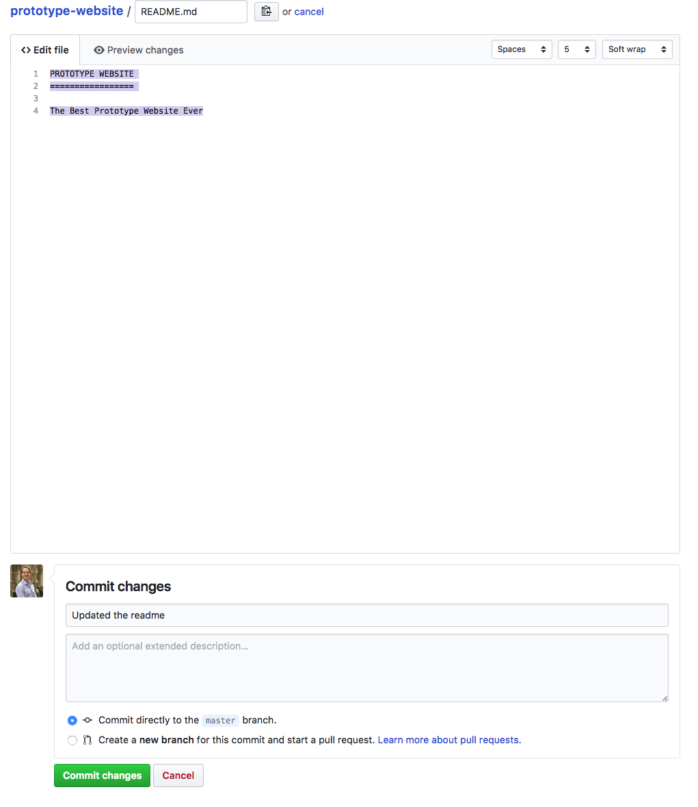
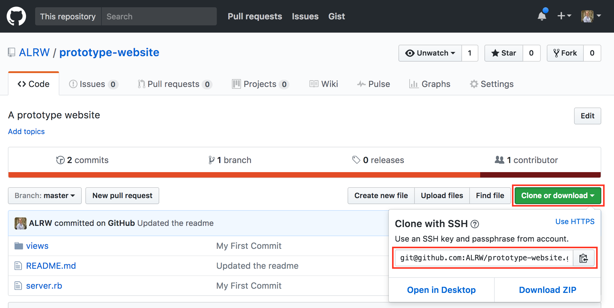

Section 6 - Pulling code from Github
====================================

To recap, by now you know how to create a repo locally and push your local code to Github. Now you also need to know how to get your code back from Github. Let's say you and one other develooper work on a website together. You both have local repos and a Github repository that you both have added as a remote called "origin". Your colleague made some changes to the website and pushed them to github. How do you get them? you need to "pull" them:

```
$ git pull origin master
```

Running this command tells git to get all the latest commits from origin and copy them into your local repository. Try pulling the changes in Cloud9 now. Nothing will happen because there are no remote changes.

Let's make a remote change. We'll use github UI for this but normally this would happen because someone else pushed new code.

:twisted_rightwards_arrows: When switching pairs this time the new driver should now use their own laptop.

Go to the git repo and click on the `README.md` file.

There is an edit button :pencil2:. Click on this and add the following to the readme:

```
PROTOTYPE WEBSITE
=================

The Best Prototype Website Ever
```



Add a commit message and then click on `Commit changes`

Excellent. We have now made changes on the Github computer. Now on your laptop (this should be the laptop that has no code written on it yet) go to your Cloud9 account and follow the steps in [section 1 from **Getting Started** to **Updating the README**](./section1.md). When you get the the final step please delete the automatically generated README.md.

This should give you a blank project. Now rather than doing all of that work again we would like to fast forward to the same point that your github repository is at.

First as this is a blank project, we need to initialise git using:

```
$ git init
```

> What do you think we need to do next before we can get the code you have on github? 

Did you guess? That's right, we need to tell your local environment to use the remote `origin` as the place it can push and pull code from.

In case you don't have the URL for the repository to hand on the repository home-page there is a helpful little button `clone or download` from which you can copy the repositories SSH link.



Then as before:

```
$ git remote add origin git@github.com:[username of the person who created the repo]/prototype-website.git
```

You should now have your local project linked to the remote repo on github that your pair created. you can check that this is correct by running:

```
$ git remote -v
```

Now to make the magic happen: if you go back to the command line and run 

```
$ git pull origin master
```

If you open up/refresh the `README.md you should now see the changes you made on Github. Neat!

Time Travelling
--------------

So far we have added our code, pushed, made some further changes and then pulled those changes back down from Github.

What if we wanted to go back in time to the first time we made a commit? 

To see all the commits that have been made in the past use the command `$ git log`. You should see something similar to the following:

```
commit 743d0c7b48698192a367892aeb67f947937e4e81
Author: Andrew Werner <awerner1@googlemail.com>
Date:   Tue Mar 21 17:22:27 2017 +0000

    Updated the readme

commit 094d3a55c05f25623d4f7d3db570e7070bf09d32
Author: Andrew <awerner1@googlemail.com>
Date:   Mon Mar 20 16:39:52 2017 +0000

    My First Commit
```

Now for the exciting part. Copy the commit ID for your first commit and run the *checkout* command like so:

```
$ git checkout 094d3a55c05f25623d4f7d3db570e7070bf09d32
```

Look at your `README.md` now. You have just travelled back to the past. Now to get us back to the present:

```
$ git checkout master
```

You should now see that our changes to the `README.md` have been reinstated. We haven't lost any work and importantly we can now propagate changes made by one person onto another persons computer and (through github) to the rest of the world.

When and how to commit
---------------------

As a final aside it wouldn't be very good if you learned all of this without touching on when and how to use git - *git-etiquete* if you will. 

A good rule of thimb is **commit early, commit often**. Whenever you make a meaningful change, make a commit. You don't have to push it to Github straight away: you can make several commits and then push them in one go.

Make a commit when you've done a meaningful piece of work. Ideally, your commit log should document the developement of the project. For example:

 - Intial commit (added Readme file)
 - Added an empty web page
 - Put a welcome message on the page
 - Added a header with a logo
 - Added a footer with a few links
 - Added /contact-us page
 
and so on and so forth (in reality it'll be more detailed and technical. Read [the commit messages of the jQuery project](https://github.com/jquery/jquery/commits/master) to get an idea of what they look like in real life.

Task 2 - Switching pairs using git
----------------------------------

:twisted_rightwards_arrows: Now that you know the basics we can integrate git into our workflow

- [ ] This time when you switch over add a line to your readme saying what you want to learn on this course then `add` and `commit` your changes `push` them up to github then your pair partner should `pull` them down. Good luck!

[Previous Section](./section5.md) | [Continue to the Answers](../tasks/task2.md)


