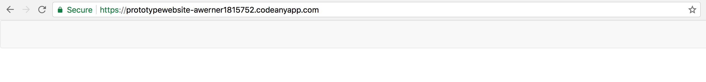

Section 7 - A Prototype Website
==============================

You've come a long way already today and now that we've accumulated a large amount of building-block knowledge lets put it to use and actually build ourselves a prototype website. 

To set the scene. A potential client has expressed interest in revamping their business website and wants to see what we are capable of. They have asked us to produce a prototype website for their "prototype" business. Kindly they have also provided us with a few user stories and a number of wireframes to work with. Fantastic.

To start with.

```
As a prototypical business owner
I need a website
To communicate my prototypes to the world
```

```
As a prototypical user 
I would like a navigation bar
In order to navigate around a prototype website
```

```
As a logo obsessed prototypical business owner
I **need** to see my prototype logo on the website navbar
In order to be able to sleep at night
```

```
As a detail oriented prototypical user
I would like to see a description of my prototype business on the websites home page
In order to understand what a "prototype" business is
```

And an initial wireframe of the page:


Where do I start?!!
-------------------

Ok so we have our starting requirements, but maybe you're thinking "*how am I going to get from the simple page with a bit of text to a pristine looking webpage?*" :confused: that is to say, this looks like a rather large jump in task size. This is a common theme for developers so it is worth discussing now. A developer produces the best results when faced with a small narrowly defined piece of work. However, we live in the real world and as this task demonstrates we need to be able to deliver. So the first task when receiving stories or requirements like the above is to break them down into small tasks that you can easily reason about. 

You may have heard developers talk about **Front end** and **Back end** - the terminology may sound a little dodgy but this is an example of this kind of seperation that allows us to reason about seperate parts of the same task. Concretely, you have already done both front-end and back end development. When you created your ruby program:

```ruby
get '/' do
  erb :index
end
```
that was you programming the back-end server to perform the task of automatically getting you a particular resource when you asked for it.

the `index.erb` that you created is your front end: the resource that will be returned to you and rendered in your web browser. A developer who works creates content for both the front end and back end is known as a full-stack developer.

So onto the first user story. To get this prototype website off the ground we need to have a route setup to serve this page for us. Handily we've already done this with the above piece of code. Why reinvent the wheel when we can reuse the work we've already done!

Adding a front-end framework
----------------------------

At this point we now want to move on to updating the content. You may remember that we've been using the framework **Sinatra** to help with our back-end code. Well now we are going to do the same with our front-end useing a framework called [Bootstrap](https://getbootstrap.com/) to help structure our page and make it look pretty.

As you may also remember the first thing we need to do is tell our program that it needs to incorporate this framework. 

Open up your `index.erb` in Cloud9 and update it to look like this:

```html
<!DOCTYPE html>
<html>
<head>
  <title>Prototype website</title>
  <link rel="stylesheet" href="https://maxcdn.bootstrapcdn.com/bootstrap/3.3.7/css/bootstrap.min.css" integrity="sha384-BVYiiSIFeK1dGmJRAkycuHAHRg32OmUcww7on3RYdg4Va+PmSTsz/K68vbdEjh4u" crossorigin="anonymous">
</head>
<body>
   <h1>Prototype Website</h1>
   <p>By tonight I'll have a fully-functioning website!</p>
</body>
</html>
```

This addition of the `<link rel="stylesheet" ... >` tells our html template to go and get the external resource located at the link specified in the `href` attribute. Don't worry too much about the specifics of the other attributes for now, suffice to say they are security related and ensure that we are pulling in what we intend and not some malicious code.

Navbar
-----

Now that we have access to bootstrap lets move forward to the next user story.

Update the `<body> ... </body>` section of your `index.erb` file with the following:

```html
<body>
  <nav class="navbar navbar-default">
    <div class="container-fluid">
    </div>
  </nav>
</body>
```

Remember to save your file and then lets start up our server again

```
$ ruby server.rb -p $PORT -o $IP
```

Hopefully when you preview your masterpiece you should see the following rather unexciting page.



Task 3
------

:twisted_rightwards_arrows: Now's a good opportunity to switch using git to add, commit, push and pull your changes then we can get on with the task.

Another thing developers spend a large amount of their time on is reading documentation. We've pulled in the bootstrap framework which gives us access to a whole bag of tools, their documentation is how we learn how to use the toolkit.

 - [ ] For this task you will need to use the [bootstrap documentation](https://getbootstrap.com/components/#navbar) to work out how to complete our 3rd user story:

```
As a logo obsessed prototypical business owner
I **need** to see my prototype logo on the website navbar
In order to be able to sleep at night
```

Kindly our client has provided the following logo for us:


