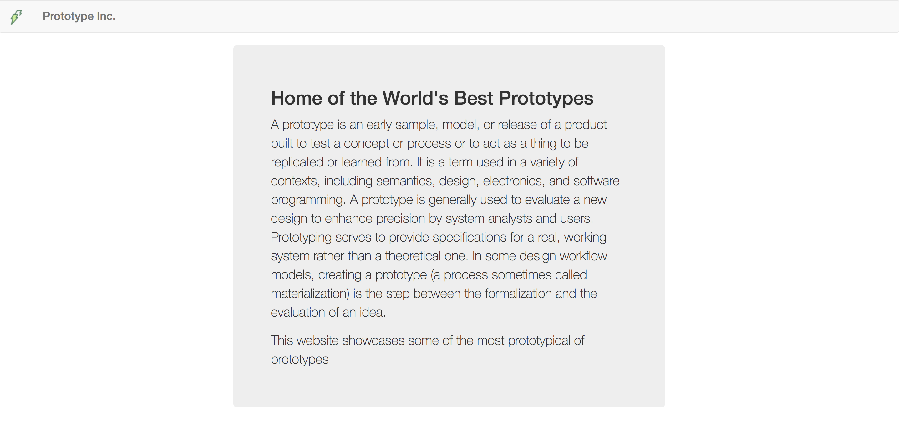

Section 8 - Finishing the Home Page
==================================

All we have left to do for our homepage now is the last of our user stories

```
As a detail oriented prototypical user
I would like to see a description of my prototype business on the websites home page
In order to understand what a "prototype" business is
```

Following the wireframe we will use the useful [bootstrap jumbotron element](https://getbootstrap.com/components/#jumbotron) within bootstraps handy [grid system](https://getbootstrap.com/css/#grid).

The client has also kindly provided us with some text that they would like us to use on the website (in this case feel free to copy and paste the text). Below your closing `</nav>` tag add in your `index.erb` add the following:

```html
<div class="container-fluid">
  <div class="row">
    <div class="col-md-3"></div>
      <div class="col-md-6">
        <div class="jumbotron">
          <h2>Home of the World's Best Prototypes</h2>
          <p>
          A prototype is an early sample, model, or release of a product built to test a concept or process or to act as a thing to be replicated or learned from.
          It is a term used in a variety of contexts, including semantics, design, electronics, and software programming.
          A prototype is generally used to evaluate a new design to enhance precision by system analysts and users. 
          Prototyping serves to provide specifications for a real, working system rather than a theoretical one. 
          In some design workflow models, creating a prototype (a process sometimes called materialization) is the step between the formalization and the evaluation of an idea.
          </p>
          <p>This website showcases some of the most prototypical of prototypes.</p>
        </div>
      </div>
    <div class="col-md-3"></div>
  </div>
</div>
```

If you refresh your preview page it should now look like the following:



At this point you're probably wondering how is bootstrap making all of our html look so pretty?!! Fear not all will soon be explained.

:twisted_rightwards_arrows:

[Return to previous section](../tasks/task3.md) | [Continue to next section](../courseSections/section9.md)
