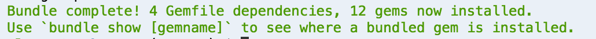
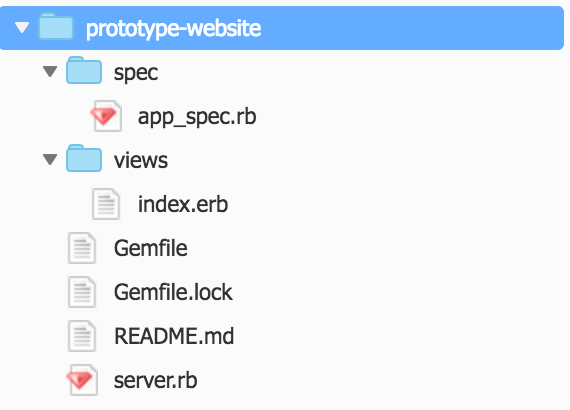

Testing
=======

[:globe_with_meridians: Go to course navigation :globe_with_meridians:](./navigation.md)

Testing is a whole topic in and of itself and there are various different tools, models and approaches. However in this case let's try and simplify things down to the bare bones.

If you look back through the journey we've come on we've already created the bare bones of a functioning website. At each stage we've made some changes and then crucially we've gone back to the webpage, refreshed and *tested* to see that our changes have taken effect. 

Now as developers you should be thinking, ok that's fine in this limited instance but what happens when this prototype website really takes off and we're adding mountains of functionality. I can manually check the whole website to make sure that my changes have come through and that they haven't broken anything else!

Luckily in the same way we can tell a computer to show us a webpage we can also get it to do our testing. Maybe that feels a little bit lazy but in this case laziness is good, embrace it!

Setting up your test suite
--------------------------

Now in the same way that we have done previously there are certain things that we need to have setup in order for us to begin to create our tests. Don't worry too much about the exact details of what we are doing. At a high level it is essentially configuration telling our program to pull in a number of other programs and setting up the parts that we need.

So without further ado, in the command line run the following:

```
$ gem install bundle
```

This gives us access to a handy little program that can pull in all our dependencies.

Now the nice thing about this program is that we can create a `Gemfile` that lives with our project and specifies all of the other programs on which it depends. This means that if anyone else were to takeover building this website they would not have to install each of these programs themselves but can do it all in one go.

To do this add a new file to your `prototype-website` directory called `Gemfile` and add the following to it

```ruby
source "https://rubygems.org"

gem "rack"
gem "sinatra"

group :test do
  gem "rspec"
  gem "rack-test"
end
```

Notice as well as adding the new *gems* (programs) that we need we've also added the sinatra framework that we had installed previously.

Now go to the command line and run:

```
$ bundle install
```

If all goes well you should see the following output:




Writing Tests
-------------

Create a new folder called `spec` and create a new file within that called `app_spec.rb`.

Your folder structure should look like this afterwards



Now let's add an initial test to check that our `server.rb` will respond to us when run.

In `app_spec.rb` add the following:

```ruby
require File.expand_path '../../server.rb', __FILE__
require 'rspec'
require 'rack/test'

ENV['RACK_ENV'] = 'test'

describe 'Prototype App' do
  include Rack::Test::Methods

  def app() Sinatra::Application end

  it 'displays the homepage' do
    get '/'
    expect(last_response.status).to eq 200
  end

end
```

Save the file and in the command line run:

```
$ rspec
```

What did you see? Is this what you expect?

While there is some initial configuration in the test file we have just created the key to understanding it is seeing that we are *describing* our Prototype App and saying that *it* displays a homepage. The test is *expecting* to see that when we ask for that page we get a [HTTP 200 response](https://httpstatuses.com/200) essentially telling us that the request has succeeded.

Great but let's see if we can go a little bit further and actually test what is on the page we have created in `index.erb`. Add the following test after the `end` of the first `it` block and before the `end` of the `describe` block.

```ruby
it 'displays the company name: Prototype Inc' do
  get '/'
  expect(last_response.body).to include "Prototype Inc."
end
```

Now save the file and run `$ rspec` again. 

You should get a quick response telling you that the tests have been successful.

Perfect. we now have the beginnings of a test suite that can be added to, saving us time manually checking everything whenever we make any further changes.

Task 4
-----

:twisted_rightwards_arrows: This time when you pull down the changes onto your computer remember that you will need to install the programs we have defined in our gemfile. To do this from the command line you should now only have to run:

```
$ gem install bundle
$ bundle install
```

 - [ ] Add a new test as an **it** description within our current tests that sees if our pages **includes** the text within our jumbotron

Everything you need should be on this page but if you're looking to do something fancy then feel free to look into the [Rspec testing framework documentation](http://www.rubydoc.info/gems/rspec-expectations/frames)

[Previous Section](./section8.md) | [Continue to the Answers](../tasks/task4.md)
