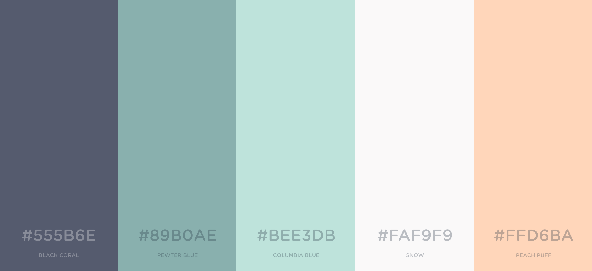

Section 8 - Adding our own style
================================

So what is Bootstrap providing for us under the scenes? So far we've written a little Ruby (telling our computer what to do), a little HTML (decribing the structure of the content we want for our page) and now we come to CSS.

CSS (more formally Cascading Style Sheets) is the technology we use to define the *layout* and *design* of the HTML *structure* we have already written. Without CSS our webpages would just be a load of left-justified, black-text-on-white-backgorund monstrosities.

Bootstrap will take us a long way, particularly when it comes to our page layout and scaling across different devices, but it still leaves a little to be desired in the looks department. So lets get under the hood and add our own styling to take our site to the next level.

Making our homepage pretty
--------------------------

Following a quick show-and-tell with our product owner they remarked that they would like the prototype to adhere to their prototype colour scheme and provided us with an additional user story and a handy colour palette.

```
As a prototypical business owner
I want my site to be decked out in prototypical colours
So that my eyes are soothed every time I open my web-browser
```

And the palette for us to use:



Now that we have our requirements let get them fulfilled.

Creating our own CSS
--------------------

Create a `public` folder in your Cloud9 workspace and then add a `css` folder inside `public`. Finally create a file called `application.css` inside the `css` folder. At the end your file tree should look a little like this:


Now in the same way we had to tell our html in `index.erb` to use the bootstrap css framework we now need to tell it to also pull in our newly created `application.css`.

Update your `<head>...</head>` section to include the following:

```html
<link rel="sylesheet" href="/css/application.css" type="text/css">
```

Notice how our `href` is in this case pointing to our local file rather than a remote url. Make sure your `index.erb` file is saved and then switch over to your blank `application.css`.


