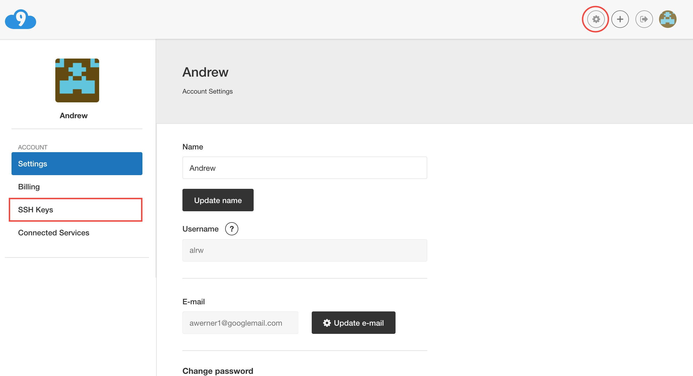
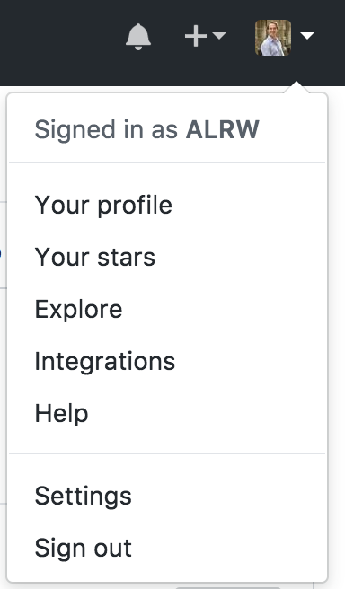
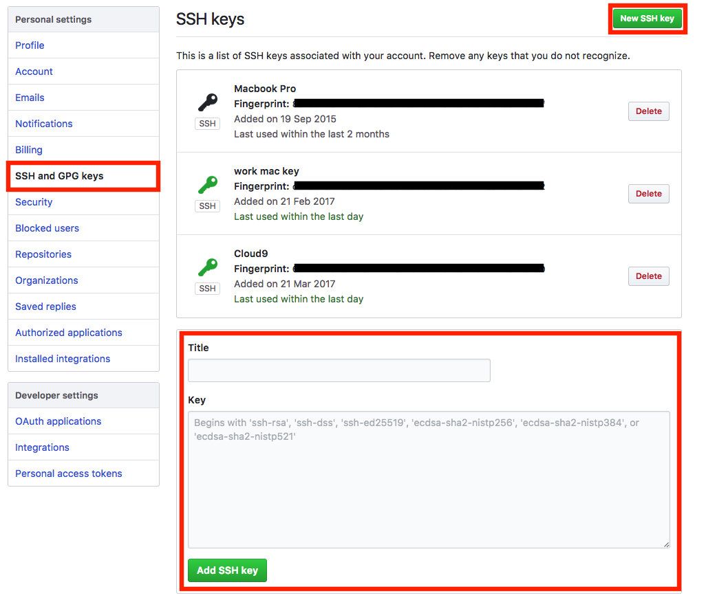

Precourse
=========

For this course we will be using a number of free services to help reduce the amount of configuration required and to allow you to focus on learning.

Before coming on this course please create a free account on each of the following (the links will take you through to the signup pages)

 - [Cloud9](https://c9.io/signup)
 - [Github](https://github.com/join)
 - [Heroku](https://signup.heroku.com)

You will need your usernames and passwords on the day so either make them memorable or use a [Secure Password Manager](https://www.lastpass.com/)

Security
--------

During the course we will be using Cloud9 and Github in conjunctions with eachother. This requires some security configuration, specifically: the two services use [Public Key Crypography](https://en.wikipedia.org/wiki/Public-key_cryptography) to authenticate their interactions. Sadly for us this requires a little bit of configuration.

On your Cloud9 home-page click on the settings icon and then onto SSH keys. Then copy the contents of the grey box.

Then on Github go Click on your account in the top right hand corner and then settings:

Once here click on `SSH and GPG keys` then `New SSH key` call the key "Cloud9" and then paste the key into the text area labelled "Key". Finally click `Add SSH key`. 

Congratulations yo now have everything need to complete the course!

