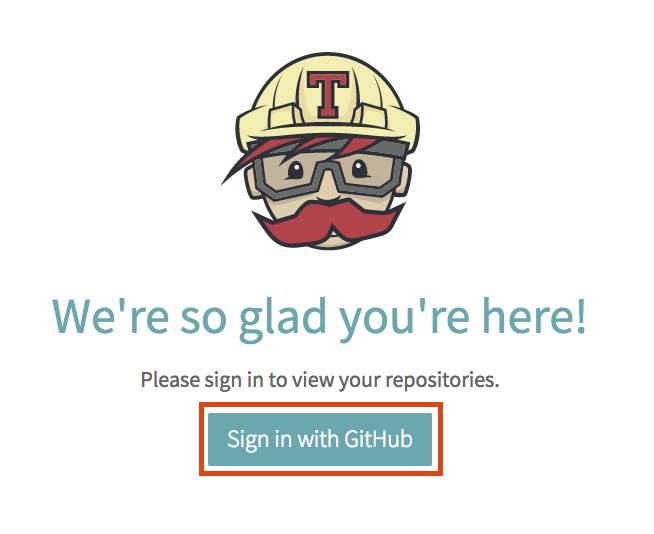

Precourse
=========

[:globe_with_meridians: Go to course navigation :globe_with_meridians:](./navigation.md)

For this course we will be using a number of free services to help reduce the amount of configuration required and to allow you to focus on learning.

Before coming on this course please create a free account for Github and Heroku(the links will take you through to the signup pages)

 - [Github :link:](https://github.com/join)
 - [Heroku :link:](https://signup.heroku.com)

Once you have these accounts you can then signup to the following services using your Github account. In both cases you will be taken through to Github to authorise access.

- [CodeAnywhere :link:](https://codeanywhere.com/signup)

- [Travis CI :link:](https://travis-ci.org/auth)

Security
--------

Security is not a dirty word, mostly. Given that we've just signed up to a load of services some of which use our credentials from another service it could be worth considering setting up two-factor authentication on your Github account.

Additionally, you will need your usernames and passwords for Github and Heroku on the day so either make them memorable or use a [Secure Password Manager :link:](https://www.lastpass.com/). And as a bit of further inculcation into the developer world here is xkcd's advice on passwords:

--------

Now enough admin! Take a minute to pat yourself on the back: you now have everything need to complete the course!

[:school: Return to the homepage :school:](./README.md)

