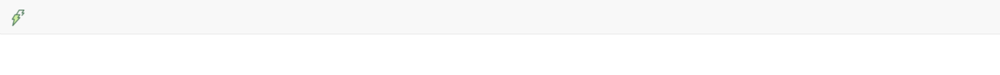

Task 3 - Adding an icon to the Navbar
=====================================

[:globe_with_meridians: Go to course navigation :globe_with_meridians:](../navigation.md)

Looking at the bootstrap documentation we can see that we just need to add a link `<a>` html tag with a `class="navbar-brand"` around an `` tag. Using the Url provided in the previous section in the `src"..."` attribute we should end up with the following in our body section:

```html
<body>
  <nav class="navbar navbar-default">
    <div class="container-fluid">
       <div class="navbar-header">
         <a class="navbar-brand" href="#">
           
         </a>
       </div>
     </div>
   </nav>
</body>
```

Let's take a minute to talk through a few of the attributes that we are adding here and explain what they do:

 - A `class` is simple a descriptive name for a group of html items that all share a similar purpose and/or style.
 - `href` is something that we'll return to but suffice to say the it is the attribute that specifies where the link (the `<a>` tag) points to. 
 - When you include an `alt` attribute you give the browser some text that will display if for whatever reason the person viewing your site is unable to load the image itself.
 - Lastly the `src` attribute tells our `` tag where it can find the image that it is meant to load for us.

All being well if you now save your `index.erb` and refresh your preview you should see a slightly more colourful navigation bar.



Now finally to add the company name all that should be required is your `<h4></h4>` to added into the html as follows:

```html
<body>
  <nav class="navbar navbar-default">
    <div class="container-fluid">
       <div class="navbar-header">
         <a class="navbar-brand" href="#">
           
         </a>
       </div>
       <h4 class="navbar-text">Prototype Inc.</h4>
     </div>
   </nav>
</body>
```

Now when we refresh the page we should see that we have everything required by the user story.


:twisted_rightwards_arrows: Good job. Lets switch over and get building the rest of our page.

--------

[:arrow_backward: Return to previous page](../courseSections/section7.md) | [Continue to next section :arrow_forward:](../courseSections/section8.md)
