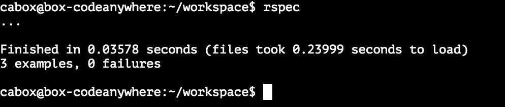

Task 4 - Testing our page content
=================================

[Go to course navigation](../navigation.md)

Hopefully you found that pretty simple.

To complete this task you should simply have had to add another test similar to the last one we wrote that checks whether the jumbotron text is included within the page. It should look similar to this:

```ruby
it 'displays the correct content' do
  get '/'
  expect(last_response.body).to include "Home of the World's Best Prototypes"
end
```

Once you've add your test and saved the `app_spec.rb` file, running `$rspec` in the command line should give you the following output.



As you can see even with such a small application the computer is still far more efficient at checking that everything is as it's meant to be in my case completing is checks in 0.2 seconds. We now do not need to manually check these features every time we make a change freeing us to work on new features in a more efficient manner.

Now lets give our site a facelift!

:twisted_rightwards_arrows:

[Return to Previous Section](../courseSections/section9.md) | [Continue to next section](../courseSections/section10.md)
