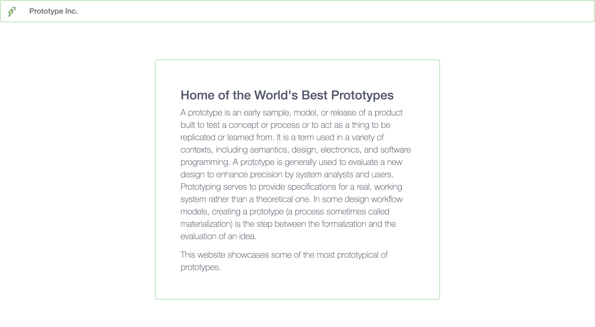
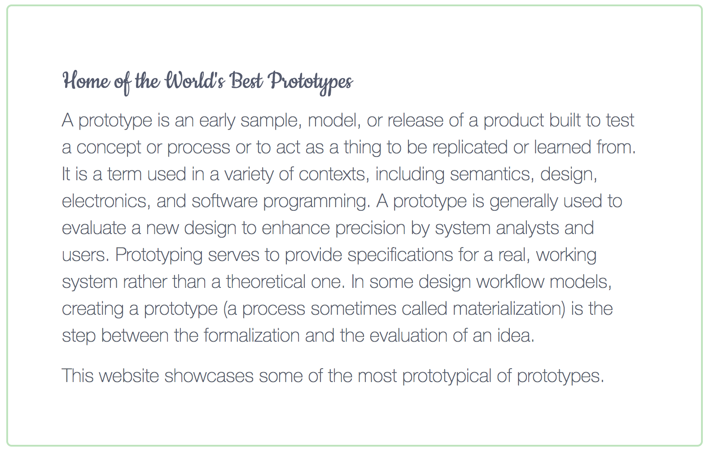

Task 5 - Styling the page.
==========================

[Go to course navigation](../navigation.md)

The first part of this task should be a relatively simple one and we should just be able to re-use some of the styling we created for our `.jumbotron`.

Styling the `.navbar` element with following:

```css
.navbar {
  border: solid 2px #BEE3BD;
  background-color: #FAF9F9;
}
```

should hopefully leave you with something similar to the screenshot below:



Now adding a font. If you follow the documentation on the google fonts page you first need tell your HTML page to import the new font. In this example I've used a font called [*Cookie*](https://fonts.google.com/specimen/Cookie?selection.family=Cookie). So adding:

```html
<head> 
  ...
   <link href="https://fonts.googleapis.com/css?family=Cookie" rel="stylesheet"> 
  ...
</head>
```

Imports the font for us. Now all that's left for us to do is to tell out text elements to use it.

In `application.css` we can specify these text elements (the `<h2>` and `<p>` tags) to use the `font-family` css attribute like so:

```css
p, h2 {
    font-family: 'Cookie', cursive;
}
```

Now when you save and refresh you should see your text wrapped in all the glory of its new font.



:twisted_rightwards_arrows: Commit your code and switch back over. Now lets see what else our mysterious client would like us to do!

[return to previous section](../courseSections/section10.md) | [Continue to next Section](../courseSections/section11.md)
